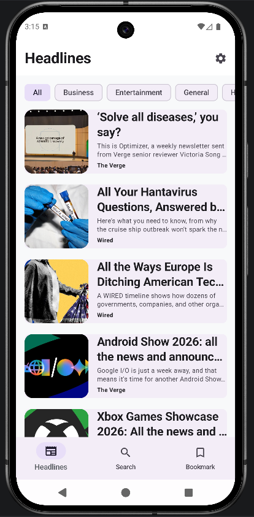
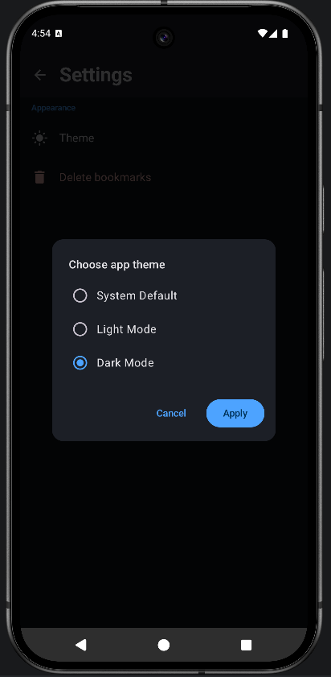
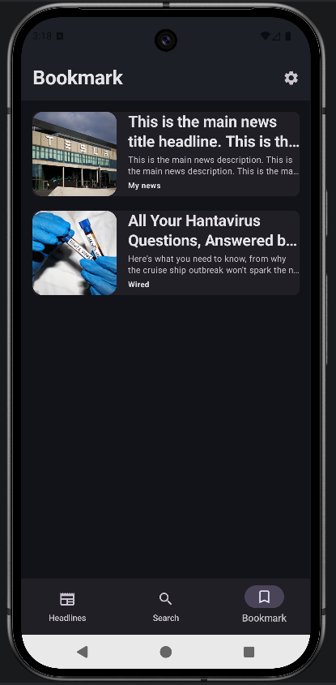
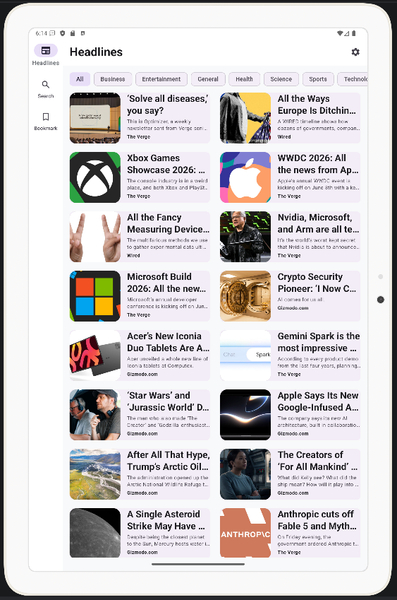
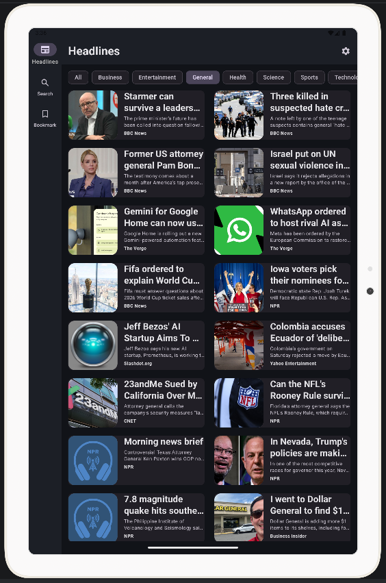
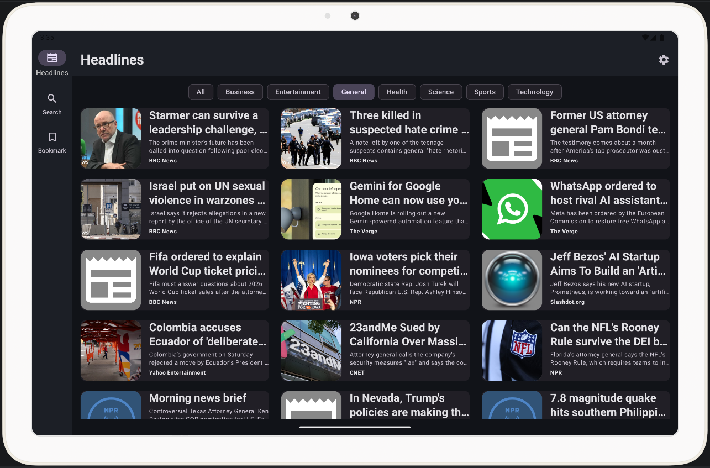
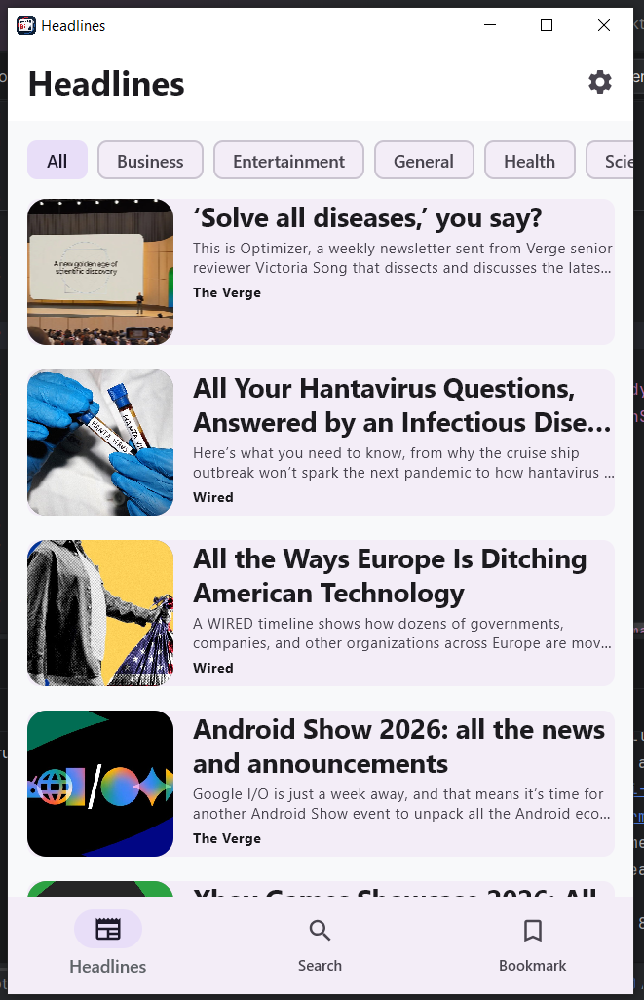
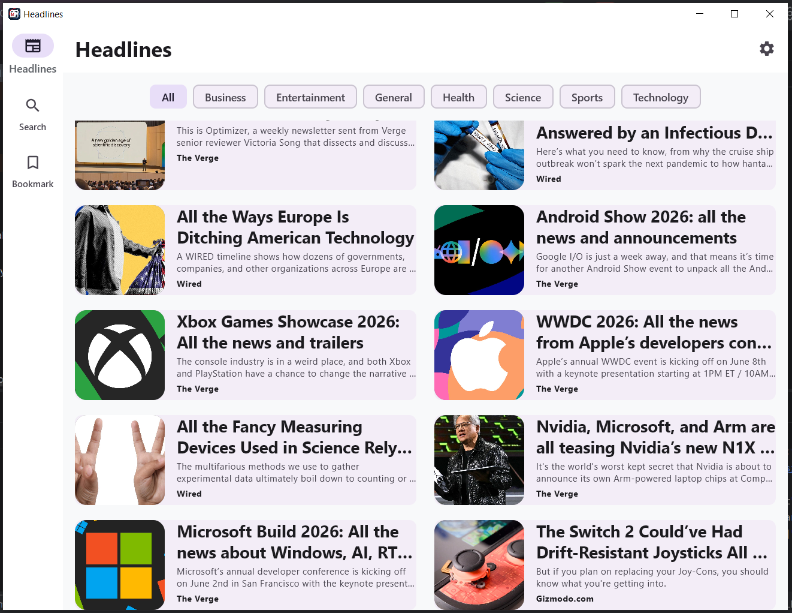
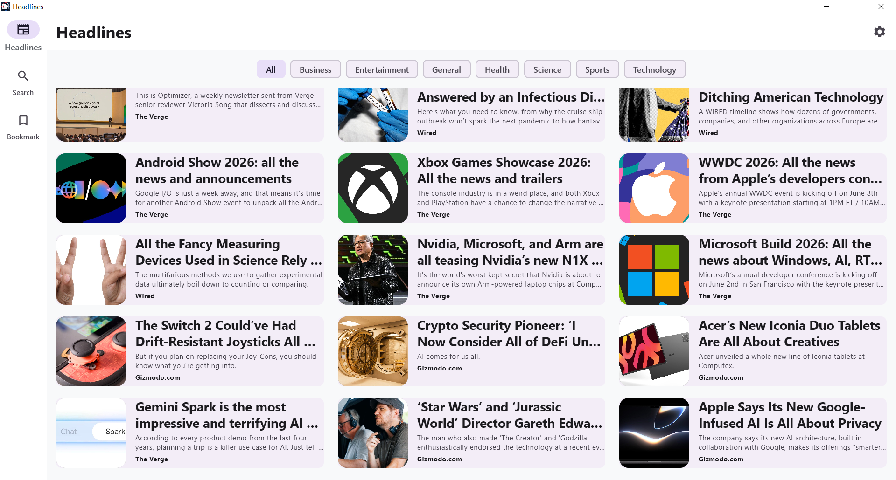
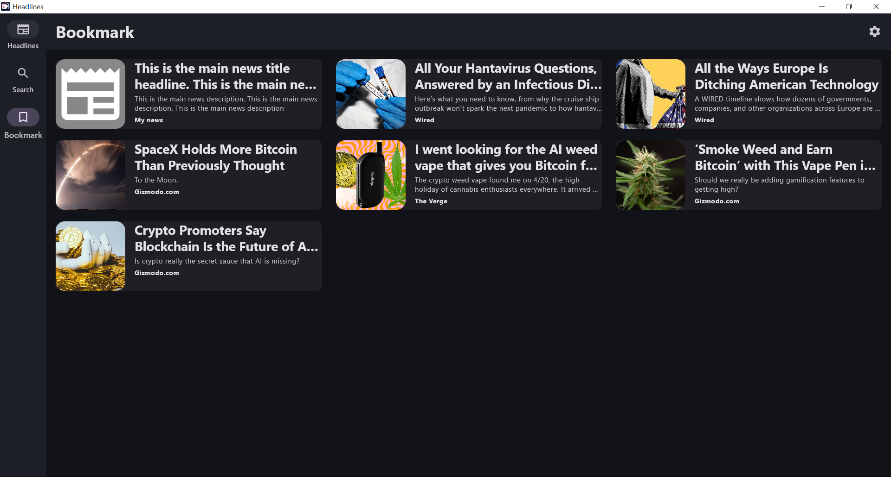

# 📰 Headlines – Kotlin Multiplatform News App

<p align="center">
  
</p>

<p align="center">
  <b>A modern cross-platform news application built with Kotlin Multiplatform & Compose Multiplatform</b><br/>
  Android • iOS • Tablet • Desktop
</p>

<p align="center">
  
  
  
  
</p>

---

## 📱 Overview

**Headlines** is a modern **Kotlin Multiplatform news app** that delivers a fast, clean, and unified reading experience across multiple platforms.

Built with **Compose Multiplatform**, it shares a single codebase for both business logic and UI while delivering a native-like experience across:

- 📱 Android
- 🍎 iOS
- 📟 Tablet
- 💻 Desktop (Windows, macOS, Linux)

---

## ✨ Features

- 🗞️ Top headlines feed by category
- 🔍 Smart article search
- 📖 Clean distraction-free reading view
- 🔖 Bookmark articles for offline reading
- 🌙 Dark / Light / System theme support
- 📱 Responsive layout (Mobile / Tablet / Desktop)
- 🧭 Type-safe navigation
- ⚡ Shimmer loading effects
- 🌍 Full cross-platform support

---

## 🛠️ Tech Stack

| Library | Purpose |
|---|---|
| [Kotlin Multiplatform](https://kotlinlang.org/docs/multiplatform.html) | Shared codebase across platforms |
| [Compose Multiplatform](https://www.jetbrains.com/lp/compose-multiplatform/) | Shared UI across platforms |
| [Ktor](https://ktor.io/) | Networking & API calls |
| [SQLDelight](https://cashapp.github.io/sqldelight/) | Local database for bookmarks |
| [Koin](https://insert-koin.io/) | Dependency injection |
| [DataStore](https://developer.android.com/topic/libraries/architecture/datastore) | Theme preference storage |
| [Coil 3](https://coil-kt.github.io/coil/) | Image loading |
| [Kotlinx Serialization](https://github.com/Kotlin/kotlinx.serialization) | JSON serialization |
| [Kotlinx Coroutines](https://github.com/Kotlin/kotlinx.coroutines) | Async operations |
| [Kermit](https://github.com/touchlab/Kermit) | Multiplatform logging |
| [NewsAPI](https://newsapi.org/) | Live news data source |

---

## 🧠 Architecture

```
UI Layer     → Composable Screens + ViewModels
Data Layer   → Repository + Remote (Ktor) + Local (SQLDelight + DataStore)
DI Layer     → Koin Modules (Common + Platform-specific)
```

- **MVVM** (Model–View–ViewModel)
- **Repository Pattern** (single source of truth)
- **Clean separation** of shared and platform-specific code
- **`expect/actual`** for platform-specific implementations

---

## 📸 Screenshots

### 📱 Mobile

<p align="center">
  
  
  
  
  
</p>

### 📟 Tablet

<p align="center">
  
  
  
  
</p>

### 💻 Desktop

<p align="center">
  
  
  
  
</p>

---

## 🎥 Demo

👉 [Watch on YouTube](https://www.youtube.com/watch?v=ID00KGyJ2u8)

---

## ⚙️ Getting Started

### Prerequisites

- Android Studio Hedgehog or later
- JDK 17+
- Xcode 15+ (for iOS)
- NewsAPI key from [newsapi.org](https://newsapi.org/)

### 1️⃣ Clone the repository

```bash
git clone https://github.com/hazratbilal/kmp-headlines-app.git
cd kmp-headlines-app
```

### 2️⃣ Add your API key

Get a free API key from [newsapi.org](https://newsapi.org/)

Then open:
```
shared/src/commonMain/kotlin/com/hazratbilal/headlines/utils/Constants.kt
```

And replace:
```kotlin
const val API_KEY = "YOUR_API_KEY"
```

> ⚠️ Keep your API key private — never commit it to GitHub

### 3️⃣ Run on Android

Open the project in Android Studio and run the `androidApp` module.

### 4️⃣ Run on Desktop

```bash
./gradlew :desktopApp:run
```

### 5️⃣ Run on iOS

Open `iosApp/iosApp.xcodeproj` in Xcode and run on a simulator or device.

---

## 📦 Download

| Platform | Download |
|---|---|
| 🤖 Android | [Download APK](https://github.com/its-hazratbilal/kmp-headlines-app/releases) |
| 💻 Desktop | [Download](https://github.com/its-hazratbilal/kmp-headlines-app/releases) |

---

## 🚀 Why This Project?

This project demonstrates:

- Real-world Kotlin Multiplatform architecture
- Shared UI and business logic across 3 platforms
- Modern Compose Multiplatform UI practices
- Clean, scalable, and maintainable codebase
- Production-ready multiplatform setup with DI, networking, and local storage

---

## 👨‍💻 Author

**Hazrat Bilal**  
Senior Android Engineer  
Kotlin • Jetpack Compose • Kotlin Multiplatform (KMP) • MVVM • Flutter

[](https://github.com/its-hazratbilal)
[](https://linkedin.com/in/hazrat-bilal-24672817a)

---

## ⭐ Support

If you find this project useful:

- ⭐ **Star** this repository
- 🍴 **Fork** it and build your own version
- 🐛 **Report issues** or suggest features
- 💬 **Share** it with the community

---

## 📄 License  
MIT License — feel free to use, modify, and distribute.
